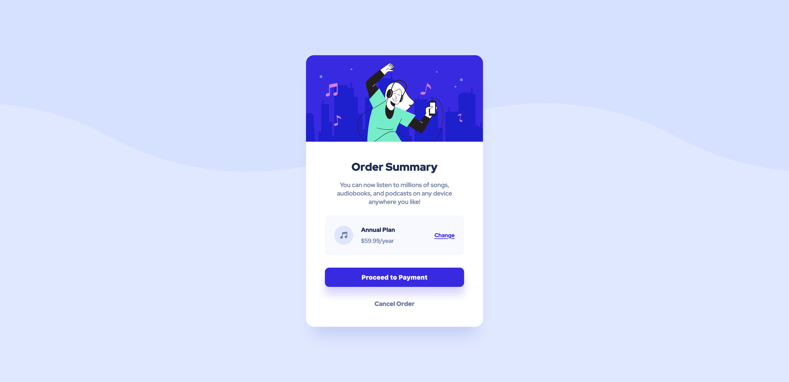

# Frontend Mentor - Order summary card solution

This is a solution to the [Order summary card challenge on Frontend Mentor](https://www.frontendmentor.io/challenges/order-summary-component-QlPmajDUj). Frontend Mentor challenges help you improve your coding skills by building realistic projects.

## Table of contents

- [Overview](#overview)
  - [The challenge](#the-challenge)
  - [Self-assigned challenges](#self-assigned-challenges)
  - [Screenshot](#screenshot)
  - [Links](#links)
- [My process](#my-process)
  - [Built with](#built-with)
  - [What I learned](#what-i-learned)
  - [Continued development](#continued-development)
  - [Useful resources](#useful-resources)
- [Author](#author)

## Overview

### The challenge

Users should be able to:

- See hover states for interactive elements

### Self-assigned challenges:

- Build mobile first, and then work up to desktop screensize rather than vice versa.
- Make a first stab at using BEM methodology for CSS.
- Try locally redefining CSS Custom properties.

### Screenshot

### Links

- [Solution URL](https://www.frontendmentor.io/solutions/order-summary-card-Zrp5vDxz2Z)
- [Live Site URL](https://sh-order-summary-card.netlify.app/)

## My process

1. Built a library of custom CSS properties for every colour, font-size, font-weight and corner radii that came up in the figma file. Padding was all over the shop, so skipped this.
2. Built my HTML with class names and wrappers for content.
3. Verified my class names according to BEM criteria.
4. Went back over the HTML to clean up any non-semantic class names I'd used as well as ensuring that I wasn't using divs when I could have been using something better (e.g. `section.card` rather than `div.card`).
5. Laid out my CSS table of contents to keep everything in order.
6. Got the card layout working, then moved onto colours and the other aesthetic stuff.
7. Coded desktop layout using media queries.
8. Double-checked against Figma file to catch anything missing.
9. Checked browser support.
10. Commit!

### Built with

- Semantic HTML5 markup
- CSS custom properties
- Flexbox

### What I learned

- That creating custom properties is potentially one of most time-consuming parts of a small project like this, so in the real world with time constraints I'd probably skip it unless this was part of a larger project.
- Being strict in creating BEM style classes is tough; it started to feel a little bit over-thought/over-engineered, but I understand that it most likely is for a project of this scale and would make more sense for a much larger project.
- That there were multiple ways to add the hero image to the card:
  1. Simply add it as an image inside the flex-container.
  2. Make it the background image of the flex-container.
  3. Use the `:before` pseudo element to add it above the header in the card.
     In the end, I chose to go with option 1 as it felt simplest for this use case. Option 2 also worked well, but it would've required using a magic number `margin-top` for the rest of the content in the card which felt unwieldy.

### Continued development

- Whilst it was interesting using BEM structure for my CSS, it didn't feel entirely comfortable to me. I'm going to try [CUBE CSS](https://cube.fyi/) next as it appears to be a little bit more CSS-y than BEM, which feels a little like it's trying to subvert CSS.
- Didn't use a reset, regretted it.
-

### Useful resources

- [BEM naming](http://getbem.com/naming/) - Probably butchered all of this but was worth giving it a shot.

## Author

- Website - [Sam Hemingway](https://samhemingway.github.io/)
- Frontend Mentor - [@SamHemingway](https://www.frontendmentor.io/profile/SamHemingway)
